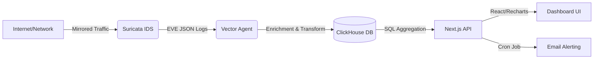

# Aerial Eye (IDS Dashboard)

 
 


**A high-performance, open-source SOC dashboard capable of ingesting, analyzing, and visualizing network threats in real-time.**

## Architecture



## Why?
Traditional SIEM solutions can be expensive and complex to deploy for small teams. This solution provides a deployable product in minutes that translates raw packet data into:
- Financial Risk Metrics: Quantify risk for executive leadership.
- Actionable Incidents: Aggregate noisy alerts into clean, investigative cases.

## Features
- Real time ingestion: Handles high-throughput logs via Vector and ClickHouse
- Geo-Enrichment: Automatically maps IP addresses to physical locations.
- Business Intelligence: Calculates estimated cost savings based on blocked threats.
- Automated Alerting: Email notifications for Severity-1 critical issues

## Installation

### Prerequisites
* **Node.js** (v18+)
* **Docker** & **Docker Compose**
* **ClickHouse** (Local or Cloud)
* **MaxMind Account** (Free tier for GeoLite2 DB)

### 1. Clone & Configure Environment
Clone the repository and navigate to the root directory.

```bash
git clone [https://github.com/sqmorrison/open-ids-dashboard.git](https://github.com/sqmorrison/open-ids-dashboard.git)
cd open-ids-dashboard
```

Configure the .env file 
```bash
cp .env.example .env
```
ensure your .env has CLICKHOUSE_HOST, CLICKHOUSE_USER, CLICKHOUSE_PASSWORD, CLICKHOUSE_DB

### 2. Setup Geo-Location Data
This project uses MaxMind for IP geolocation. You must download the database manually due to licensing
#### 1.) Sign up for a free account at MaxMind (www.maxmind.com)
#### 2.) Download the GeoLite2 City database (MMDB format)
#### 3.) Create a folder named GeoLite2-City in the root (or where your Vector config expects it)
```bash
mkdir GeoLite2-City
```
#### 4.) Place the .mmdb file inside /GeoLite2-City (so it should look like /GeoLite2-City/GeoLite2-City.mmdb)

### 3. Initialize the Database
The database initializes automatically when the container starts. Run this from the root directory:
```bash 
docker-compose up -d
```

### 4. Configure the IDS Rules
Define what network traffic you want to alert on.
Currently, the rules are configured to alert on any http traffic, this is purely for testing purposes.
```bash
nano rules/local.rules
```

### 5. Configure Suricata to monitor your traffic (Production Mode)
Skip this step if you just want to test with dummy data.

By default, the `docker-compose.yml` is configured for development. To monitor real traffic on a physical network interface (like a true SOC), you must update the Suricata service to use **Host Networking**.

Start by updating 'docker-compose.yml'

Open your compose file and make two changes to the `suricata` service:
1.  Add `network_mode: host`.
2.  Update the command to listen on your host's actual interface name (e.g., `eth0`, `enp3s0`, `wlan0`).

```yaml
  suricata:
    image: jasonish/suricata:latest
    container_name: suricata
    # 1. Enable Host Networking (Bypasses Docker NAT to see real traffic)
    network_mode: host
    cap_add:
      - NET_ADMIN
      - NET_RAW
      - SYS_NICE
    volumes:
      - ${PWD}/logs/suricata:/var/log/suricata
      - ${PWD}/rules:/var/lib/suricata/rules
    # 2. Update '-i' to your actual interface name (Run 'ip addr' to find it)
    command: -c /etc/suricata/suricata.yaml -i enp3s0 -k none -s /var/lib/suricata/rules/local.rules
```

Then identify your interface (these commands are for macOS or Linux)
```bash
ip addr # Linux
ifconfig # Mac
```
Look for main internet-connected interface (usually eth0, wlan0, or enp...) replace enp3s0 in docker-compose.yml above with your specific identifier.

Lastly, you'll want to enter promiscuous mode so the interface accepts packets not addressed to itself (if your're mirroring traffic from a switch)
```bash
sudo ip link set enp3s0 promisc on
```

### 6. Configure Alerting (Email)

The system automatically sends email notifications for **Severity 1 (Critical)** threats. It supports two modes:

#### Option A: Development Mode (Default)
You do **not** need to configure anything to test alerts.
1. Leave the `SMTP_` variables in your `.env` file blank.
2. When an alert triggers, look at your terminal console.
3. You will see a log message like this:
   ```bash
   [MAIL] Preview URL: [https://ethereal.email/message/WaQKMgKddxQDoou](https://ethereal.email/message/WaQKMgKddxQDoou)...
   ```
4. Click the link to view the rendered email in your browser

### Option B: Production Mode (Real Emails)
To send actual emails to your inbox, configure an SMTP provider (like Gmail or Outlook) in your .env file

Example for gmail: (for gmail, you must use an App Password, not your login password)
```bash
SMTP_HOST=smtp.gmail.com
SMTP_PORT=587
SMTP_USER=your.email@gmail.com
SMTP_PASS=your_app_password_here
ALERT_EMAIL_RECIPIENT=security-team@yourcompany.com
```

### 7. Start the Dashboard
Navigate to the web application folder and start the dev server
```bash
cd apps/web
npm install
npm run dev
```

open http://localhost:3000 to view the dashboard

## Engineering Decisions and Trade-Offs
Q: Why ClickHouse?
A: Chosen for ClickHouse's ability to handle OLAP queries on millions of rows instantly unlike another db like Postgres

Q: Why Vector?
A: Chosen over Logstash for its Rust-based performance and memory safety.

## BYO Data
### Bring your own data:
This dashboard is data agnostic, we have a default config for Suricata, but you can use any tool you are familiar with by simply ensuring your data ends up in the ClickHouse ids.events table with the following structure

| Column Name     | Type     | Description                     |
|-----------------|----------|---------------------------------|
| timestamp       | DateTime | When the event occurred         |
| src_ip          | IPv4     | Attacker / Source IP            |
| dest_ip         | IPv4     | Target / Destination IP         |
| alert_signature | String   | Name of the threat (eg Malware) |
| alert_severity  | UInt8    | 1 (critical) to 3 (low)         |
| alert_category  | String   | Class of attack (eg Trojan)     |

### How to implement 
Modify your vector.toml to ingest your custom logs and use a Vector Remap Language (VRL) transform to rename your fields to match the columns above before sinking to ClickHouse

## AI Co-Pilot (Optional)

Turn your dashboard into an active analyst. The AI module runs locally (via Ollama) to explain alerts, suggest remediation, and write SQL queries for you.

**Privacy Note:** No data leaves your network. All inference happens on your hardware.

### 1. Enable the Service
Uncomment the `ai` service in your `docker-compose.yml` file.

### 2. Start the Stack
```bash
docker-compose up -d
```
### 3. Initialize the Model (One-Time Setup)

Since we don't bundle the 4GB model file in the git repo, you must pull it once after the container starts. We recommend mistral (fast/light) or llama3 (smarter/heavier).
```Bash
# For a balance of speed and intelligence (Recommended)
docker exec -it open-ids-ai ollama pull mistral
# OR for higher accuracy (Requires ~6GB RAM)
docker exec -it open-ids-ai ollama pull llama3
```
### 4. Hardware Requirements:
    RAM: Minimum 8GB system total (4GB dedicated to Docker).
    CPU: AVX support (standard on most CPUs post-2015).
    GPU: Optional. If you have an NVIDIA GPU, pass it to Docker for 10x speed.
