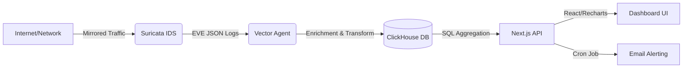

# Aerial Eye (IDS Dashboard)


**A high-performance, open-source SOC dashboard capable of ingesting, analyzing, and visualizing network threats in real-time.**

## Architecture



- Frontend: Next.js 16, React 19, TypeScript, Tailwind CSS, Recharts, Shadcn/UI
- Backend: Next.js API Routes, ClickHouse client
- Data Pipeline: Vector (Rust-based log processor)
- Database: ClickHouse (OLAP database)
- IDS: Suricata
- AI: Ollama (local LLM inference)
- Email: Nodemailer
- Deployment: Docker Compose

## Why?

Traditional SIEM solutions can be expensive and complex to deploy for small teams. This solution provides a deployable product in minutes that translates raw packet data into:

- Financial Risk Metrics: Quantify risk for executive leadership.
- Actionable Incidents: Aggregate noisy alerts into clean, investigative cases.

## Features

- Real time ingestion: Handles high-throughput logs via Vector and ClickHouse
- Geo-Enrichment: Automatically maps IP addresses to physical locations.
- Business Intelligence: Calculates estimated cost savings based on blocked threats.
- Automated Alerting: Email notifications for Severity-1 critical issues
- Local AI Co-pilot: Analyze logs you don't understand with an open source, local AI model, ensuring your data stays safe while demystifying what's in front of you
- Natural Language to SQL: AI powered "ask the database" feature, your local AI model will generate a sql query based on your plain english request, ex "Show me all critical alerts from today" will return a select statement that can be edited if incorrect or then followed up on and run on the database. Only select queries are allowed.
- Heat Map: Visualize where attacks are coming from across the globe
- Analyst Workflow: Triage mode, where individual events can be viewed by time, alert signature, and have a status associated with them (like new, reviewed, false positive, investigating). Simple notes can also be added to every event.

## Installation

### Prerequisites

- **Node.js** (v18+)
- **Docker** & **Docker Compose**
- **ClickHouse** (Local or Cloud)
- **MaxMind Account** (Free tier for GeoLite2 DB)

### 1. Clone & Configure Environment

Clone the repository and navigate to the root directory.

```bash
git clone [https://github.com/sqmorrison/open-ids-dashboard.git](https://github.com/sqmorrison/open-ids-dashboard.git)
cd open-ids-dashboard
```

Configure the .env file

```bash
cp .env.example .env
```

ensure your .env has CLICKHOUSE_HOST, CLICKHOUSE_USER, CLICKHOUSE_PASSWORD, CLICKHOUSE_DB

### 2. Setup Geo-Location Data

This project uses MaxMind for IP geolocation. You must download the database manually due to licensing

#### 1.) Sign up for a free account at MaxMind (www.maxmind.com)

#### 2.) Download the GeoLite2 City database (MMDB format)

#### 3.) Create a folder named GeoLite2-City in the root (or where your Vector config expects it)

```bash
mkdir GeoLite2-City
```

#### 4.) Place the .mmdb file inside /GeoLite2-City (so it should look like /GeoLite2-City/GeoLite2-City.mmdb)

### 3. Initialize the Database

The database initializes automatically when the container starts. Run this from the root directory:

```bash
docker-compose up -d
```

### 4. Configure the IDS Rules

Define what network traffic you want to alert on.
Currently, the rules are configured to alert on any http traffic, this is purely for testing purposes.

```bash
nano rules/local.rules
```

### 5. Configure Suricata to monitor your traffic (Production Mode)

Skip this step if you just want to test with dummy data.

By default, the `docker-compose.yml` is configured for development. To monitor real traffic on a physical network interface (like a true SOC), you must update the Suricata service to use **Host Networking**.

Start by updating 'docker-compose.yml'

Open your compose file and make two changes to the `suricata` service:

1.  Add `network_mode: host`.
2.  Update the command to listen on your host's actual interface name (e.g., `eth0`, `enp3s0`, `wlan0`).

```yaml
suricata:
  image: jasonish/suricata:latest
  container_name: suricata
  # 1. Enable Host Networking (Bypasses Docker NAT to see real traffic)
  network_mode: host
  cap_add:
    - NET_ADMIN
    - NET_RAW
    - SYS_NICE
  volumes:
    - ${PWD}/logs/suricata:/var/log/suricata
    - ${PWD}/rules:/var/lib/suricata/rules
  # 2. Update '-i' to your actual interface name (Run 'ip addr' to find it)
  command: -c /etc/suricata/suricata.yaml -i enp3s0 -k none -s /var/lib/suricata/rules/local.rules
```

Then identify your interface (these commands are for macOS or Linux)

```bash
ip addr # Linux
ifconfig # Mac
```

Look for main internet-connected interface (usually eth0, wlan0, or enp...) replace enp3s0 in docker-compose.yml above with your specific identifier.

Lastly, you'll want to enter promiscuous mode so the interface accepts packets not addressed to itself (if your're mirroring traffic from a switch)

```bash
sudo ip link set enp3s0 promisc on
```

### 6. Configure Alerting (Email)

The system automatically sends email notifications for **Severity 1 (Critical)** threats. It supports two modes:

#### Option A: Development Mode (Default)

You do **not** need to configure anything to test alerts.

1. Leave the `SMTP_` variables in your `.env` file blank.
2. When an alert triggers, look at your terminal console.
3. You will see a log message like this:
   ```bash
   [MAIL] Preview URL: [https://ethereal.email/message/WaQKMgKddxQDoou](https://ethereal.email/message/WaQKMgKddxQDoou)...
   ```
4. Click the link to view the rendered email in your browser

### Option B: Production Mode (Real Emails)

To send actual emails to your inbox, configure an SMTP provider (like Gmail or Outlook) in your .env file

Example for gmail: (for gmail, you must use an App Password, not your login password)

```bash
SMTP_HOST=smtp.gmail.com
SMTP_PORT=587
SMTP_USER=your.email@gmail.com
SMTP_PASS=your_app_password_here
ALERT_EMAIL_RECIPIENT=security-team@yourcompany.com
```

### 7. Start the Dashboard

Navigate to the web application folder and start the dev server

```bash
cd apps/web
npm install
npm run dev
```

open http://localhost:3000 to view the dashboard

## Engineering Decisions and Trade-Offs

Q: Why ClickHouse?
A: Chosen for ClickHouse's ability to handle OLAP queries on millions of rows instantly unlike another db like Postgres

Q: Why Vector?
A: Chosen over Logstash for its Rust-based performance and memory safety.

## BYO Data

### Bring Your Own Data

This dashboard is data agnostic. While we provide a default configuration for Suricata, you can use any security tool or log source by ensuring your data conforms to the `ids.events` table schema in ClickHouse.

### Required Table Schema: `ids.events`

Your data must match the following ClickHouse table structure:

#### **Required Fields** (Must be present for all events):

| Column Name       | Type          | Description                                         |
| ----------------- | ------------- | --------------------------------------------------- |
| `timestamp`       | DateTime64(3) | When the event occurred (millisecond precision)     |
| `event_type`      | String        | Type of event (e.g., "alert", "flow", "http")       |
| `src_ip`          | IPv4          | Source/attacker IP address                          |
| `src_port`        | UInt16        | Source port number (0-65535)                        |
| `dest_ip`         | IPv4          | Destination/target IP address                       |
| `dest_port`       | UInt16        | Destination port number (0-65535)                   |
| `proto`           | String        | Protocol (e.g., "TCP", "UDP", "ICMP")               |
| `alert_action`    | String        | Action taken (e.g., "allowed", "blocked")           |
| `alert_signature` | String        | Threat signature name (e.g., "ET MALWARE...")       |
| `alert_severity`  | UInt8         | Severity level: 1=Critical, 2=High, 3=Medium        |
| `alert_category`  | String        | Attack category (e.g., "Trojan", "APT")             |
| `raw_json`        | String        | Full event payload as JSON string (for AI analysis) |

#### **Optional Fields** (Will default if not provided):

| Column Name        | Type                   | Default Value  | Description                   |
| ------------------ | ---------------------- | -------------- | ----------------------------- |
| `event_uuid`       | UUID                   | Auto-generated | Unique event identifier       |
| `src_country`      | String                 | "Unknown"      | Source country name           |
| `src_country_code` | LowCardinality(String) | "XX"           | ISO country code (e.g., "US") |

### Implementation Guide
**Using Vector**

Modify `packages/database/vector.toml` to:

1. **Add a new source** for your log format:

   ```toml
   [sources.your_logs]
   type = "file"  # or "http", "kafka", etc.
   include = ["/path/to/your/logs/*.json"]
   ```

2. **Create a transform** to normalize your fields:

   ```toml
   [transforms.your_normalize]
   type = "remap"
   inputs = ["your_logs"]
   source = '''
     # Map your fields to the schema
     .timestamp = parse_timestamp!(.your_timestamp_field, format: "%Y-%m-%dT%H:%M:%S.%fZ")
     .timestamp = to_unix_timestamp(.timestamp, unit: "milliseconds")

     .event_type = "alert"
     .src_ip = .source_ip
     .dest_ip = .destination_ip
     .alert_signature = .threat_name
     .alert_severity = to_int(.severity) ?? 3
     .raw_json = encode_json(.)

     # Add GeoIP enrichment (optional)
     .src_country = "Unknown"
     .src_country_code = "XX"
   '''
   ```

3. **Add GeoIP enrichment** (optional):

   ```toml
   [transforms.enrich_geoip]
   type = "remap"
   inputs = ["your_normalize"]
   source = '''
     geo_data, err = get_enrichment_table_record("geoip_table", { "ip": .src_ip })
     if err == null && geo_data != null {
       .src_country = geo_data.country.names.en || "Unknown"
       .src_country_code = geo_data.country.iso_code || "XX"
     }
   '''
   ```

4. **Route to ClickHouse sink**:
   ```toml
   [sinks.clickhouse]
   type = "clickhouse"
   inputs = ["enrich_geoip"]  # or ["your_normalize"] if skipping GeoIP
   endpoint = "http://clickhouse:8123"
   database = "ids"
   table = "events"
   ```

### Field Mapping Tips

- **IPv4 addresses**: Must be valid IPv4 strings (e.g., `"192.168.1.1"`), not integers
- **Timestamps**: Use Unix milliseconds (or let Vector convert from ISO strings)
- **Severity**: Use numeric values: `1` (Critical), `2` (High), `3` (Medium/Low)
- **raw_json**: Store the complete original event as a JSON string for AI analysis and deep inspection

## AI Co-Pilot

Turn your dashboard into an active analyst. The AI module runs locally (via Ollama) to explain alerts, suggest remediation, and write SQL queries for you.

**Privacy Note:** No data leaves your network. All inference happens on your hardware.

### 1. Start the Stack

```bash
docker-compose up -d
```

### 2. Initialize the Model (One-Time Setup)

Since we don't bundle the 4GB model file in the git repo, you must pull it once after the container starts. We recommend mistral (fast/light) or llama3 (smarter/heavier).

```Bash
# For a balance of speed and intelligence (Recommended)
docker exec -it open-ids-ai ollama pull mistral
# OR for higher accuracy (Requires ~6GB RAM)
docker exec -it open-ids-ai ollama pull llama3
```

### 3. Hardware Requirements:

    RAM: Minimum 16GB+ system total (7GB dedicated to Docker).
    CPU: AVX support (standard on most CPUs post-2015).
    GPU: Optional. If you have an NVIDIA GPU, pass it to Docker for better speed.
